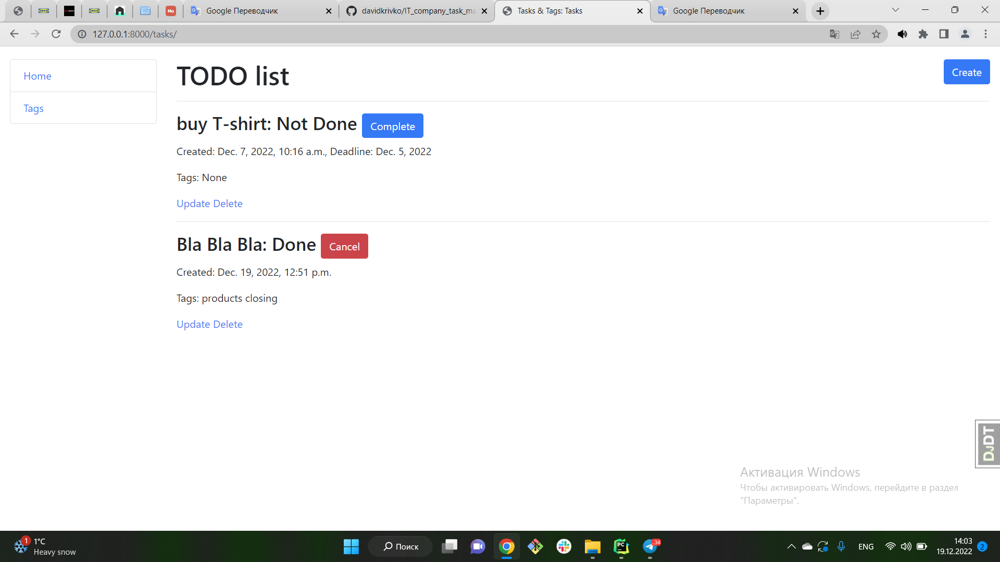

# Tasks-Tegs

Task tracking website

## Functions

```shell
1) You can create, edit and delete your tasks.
2) You can add Tags and add it for tasks
3) You can mark completed tasks
```

## Visual



## Installation

Python3 must be already installed

```
git clone https://github.com/davidkrivko/Tasks-Tegs.git
cd Task-Tegs
python3 -m venv venv
source venv/bin/activate
pip install -r requirements.txt
python manage.py runserver
```

## Add database

```shell
python manage.py makemigrations
python manage.py migrate
```